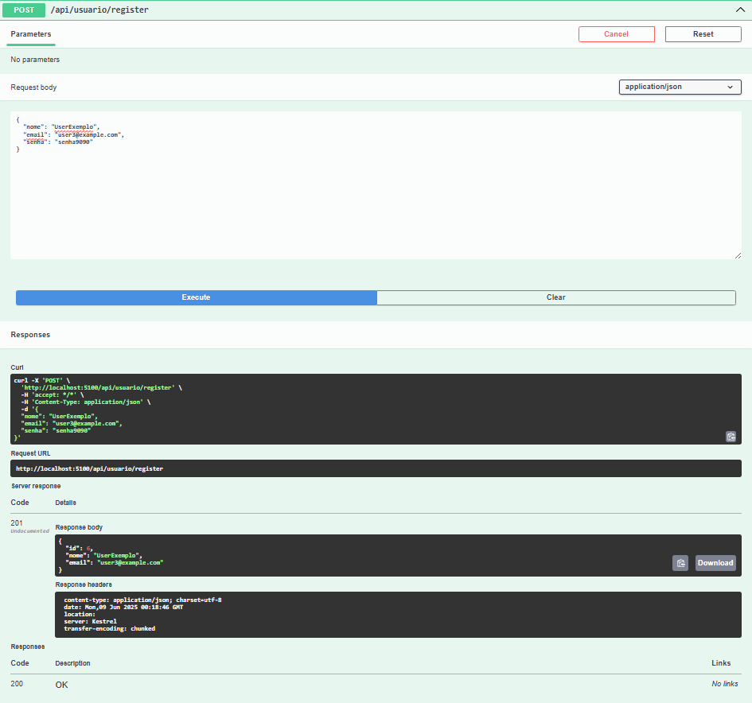
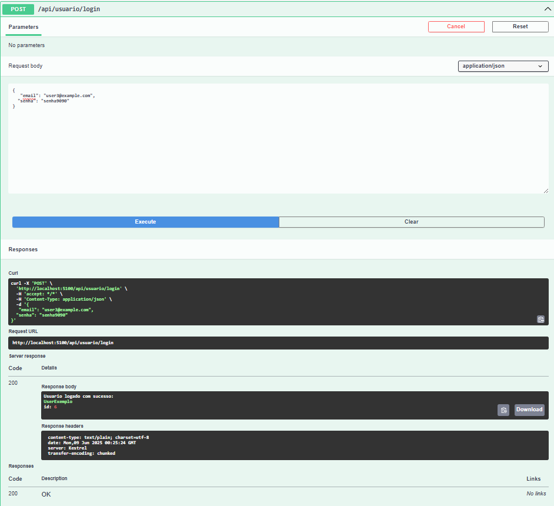
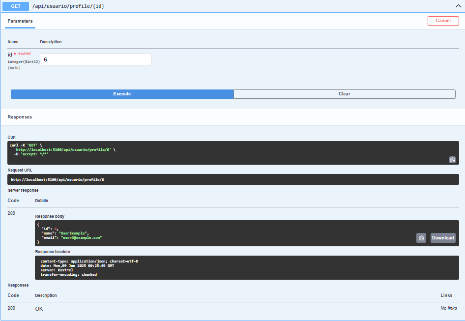
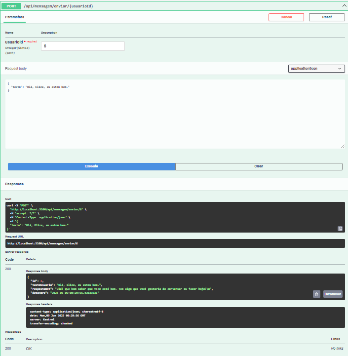
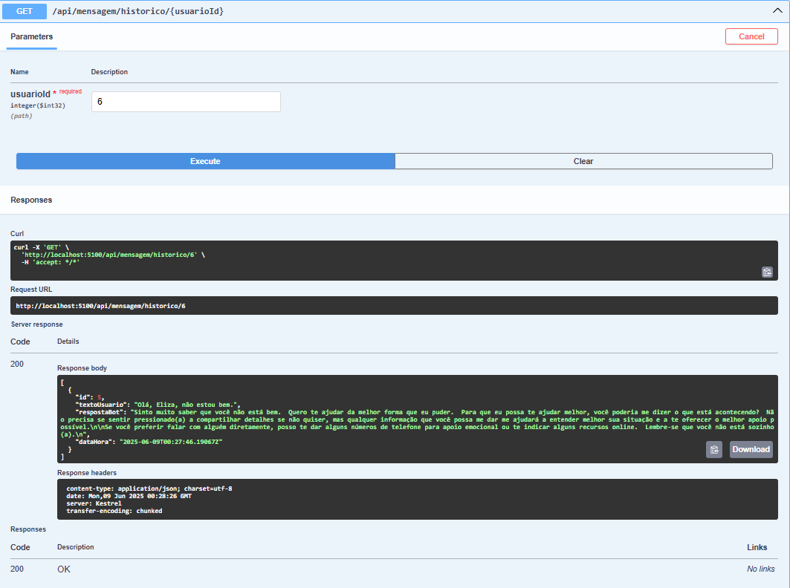
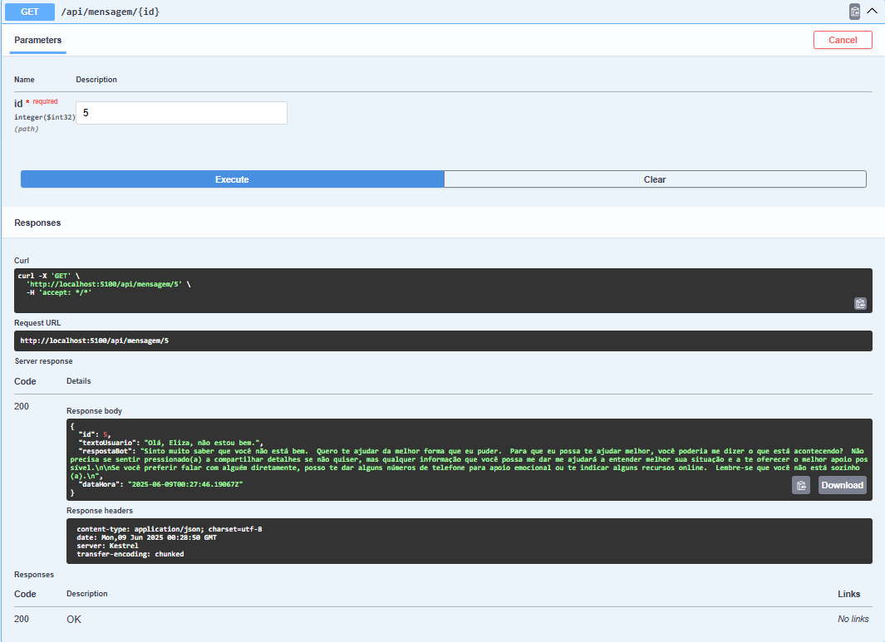
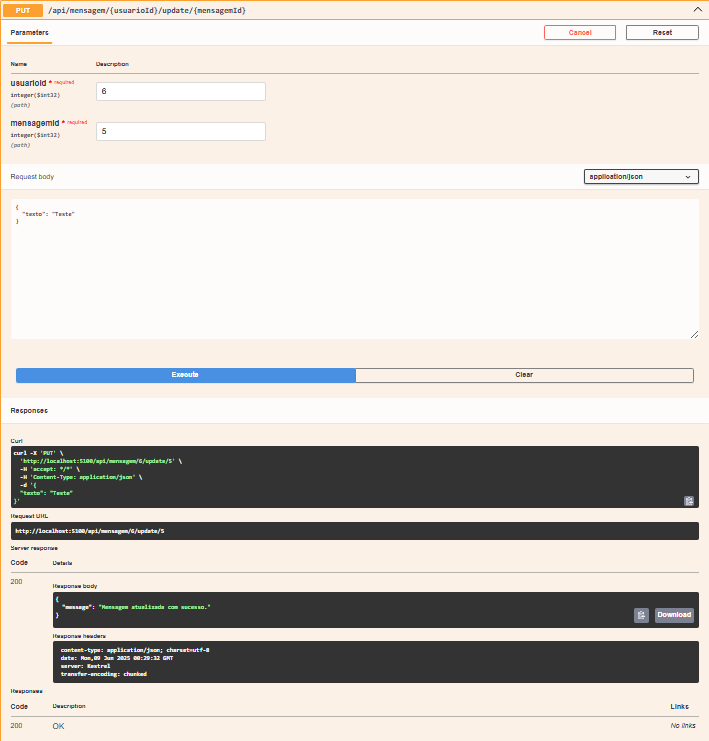
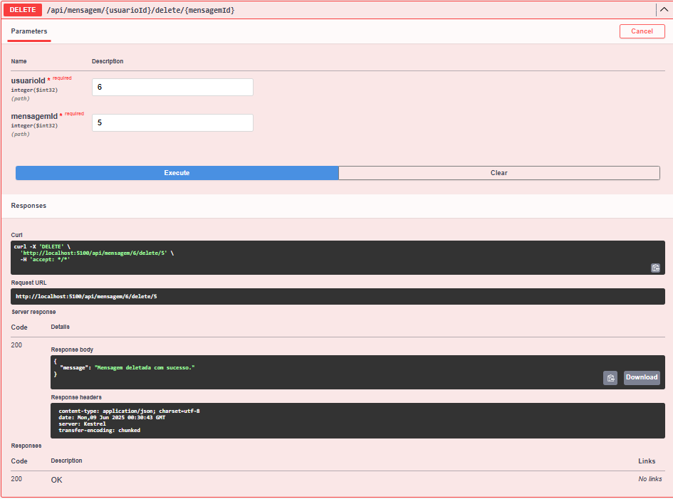

# eliza2-api

Eliza � uma API RESTful desenvolvida em Java com Spring Boot, concebida como um MVP para servir como psic�loga virtual emp�tica e acess�vel, especialmente voltada ao suporte psicol�gico de pessoas em situa��o de vulnerabilidade ap�s desastres, cat�strofes naturais ou grandes crises sociais.

A solu��o integra a intelig�ncia artificial do Google Gemini, permitindo conversas humanizadas, acolhedoras e responsivas, capazes de entender o contexto emocional do usu�rio e oferecer orienta��es ou encaminhamentos de forma segura e �tica. A IA foi treinada para compreender demandas sens�veis e proporcionar suporte inicial at� que o indiv�duo possa receber acompanhamento especializado.


Como MVP, Eliza foi projetada para ser facilmente expandida no futuro, permitindo integra��es com outros servi�os de assist�ncia social, plataformas de telemedicina, equipes de resposta a emerg�ncias e �rg�os de sa�de p�blica. A API pode ser incorporada a aplicativos m�veis, portais de atendimento emergencial e sistemas de monitoramento p�s-crise, promovendo cuidado psicol�gico imediato e humanizado em larga escala.
## Tecnologias Utilizadas

- ASP.NET Core 8
- Entity Framework Core
- PostgreSQL
- Swagger (OpenAPI)
- Gemini API (Google Generative Language)
- Razor Pages

## Configura��o

1. **Clone o reposit�rio:**
   


2. **Configure a string de conex�o no `appsettings.json`:**
```bash 
"ConnectionStrings": { "DefaultConnection": "Host=localhost;Database=eliza2db;Username=seu_usuario;Password=sua_senha" }
```


 
3. **Rode as migrations para criar o banco de dados:**
```bash
dotnet ef database update
```
 
4. **Execute o projeto:**
```bash
dotnet run
```

## Endpoints Principais

Acesse a documenta��o interativa via Swagger em:  
`https://localhost:{porta}/swagger`

### Usu�rios

- `POST /api/usuario/register` � Cadastro de usu�rio


- `POST /api/usuario/login` � Login de usu�rio

- `GET /api/usuario/profile` � Perfil de usuário


### Mensagens

- `POST /api/mensagem/enviar/{usuarioId}` � Envia uma mensagem e recebe resposta do Gemini

- `GET /api/mensagem/historico/{usuarioId}` � Lista o hist�rico de mensagens do usu�rio

- `GET /api/mensagem/{id}` � Busca uma mensagem espec�fica

- `PUT /api/mensagem/{usuarioId}/{mensagemId}` � Atualiza uma mensagem

- `DELETE /api/mensagem/{usuarioId}/{mensagemId}` � Remove uma mensagem


## Estrutura do Projeto

- `Controllers/` � Controllers da API
- `Services/` � Servi�os de neg�cio e integra��o (incluindo Gemini)
- `Model/Entity/` � Entidades do banco de dados
- `Model/DTO/` � Objetos de transfer�ncia de dados
- `Data/` � Contexto do Entity Framework

## Observa��es

- Certifique-se de que a API Key do Gemini est� correta em `GeminiService`.
- O projeto utiliza HTTPS por padr�o.
- Para ambiente de desenvolvimento, o Swagger est� habilitado.

---

Projeto acad�mico da FIAP, desenvolvido para a mat�ria de ADVANCED BUSINESS DEVELOPMENT WITH .NET
